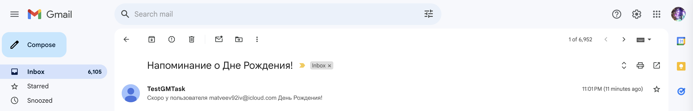

# Birthday Notifications Service

[](https://fastapi.tiangolo.com/)
[](https://www.python.org/)
[](https://www.postgresql.org/)
[](https://www.docker.com/)

Сервис для отправки уведомлений о Днях Рождений пользователей. Разработан как часть тестового задания и успешно реализует все требуемые функции.

## 🛠 Стек

- **FastAPI**
- **SQLAlchemy**
- **PostgreSQL**
- **FastAPI-Mail**
- **APScheduler**

## 🚀 Начало работы

1. Клонируйте репозиторий:
   ```bash
   git clone https://github.com/Soleil31/TestGM.git

2. В корне проекта создайте файл .env, пример такого файла можно найти в env.example
3. Запустите при помощи одной из двух команд:
    ```
    docker-compose up -d
    ```
    ```
    uvicorn main:app --reload
    ```
4. Тестируйте! :)

## Пример работы

